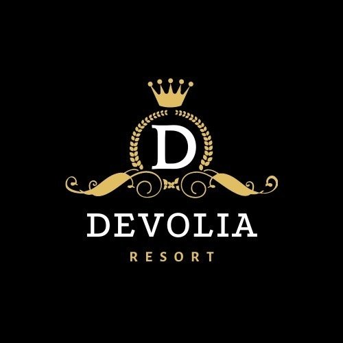
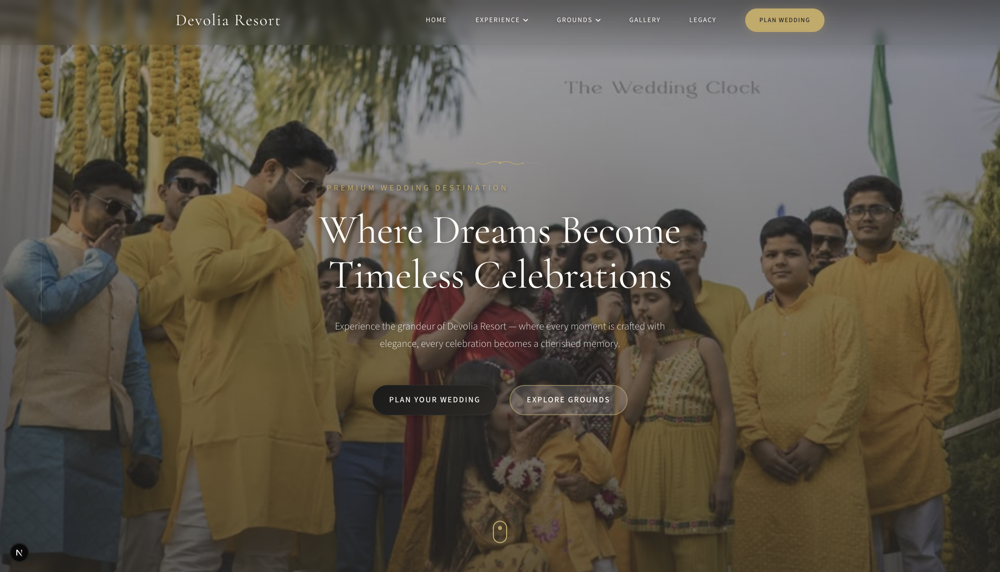
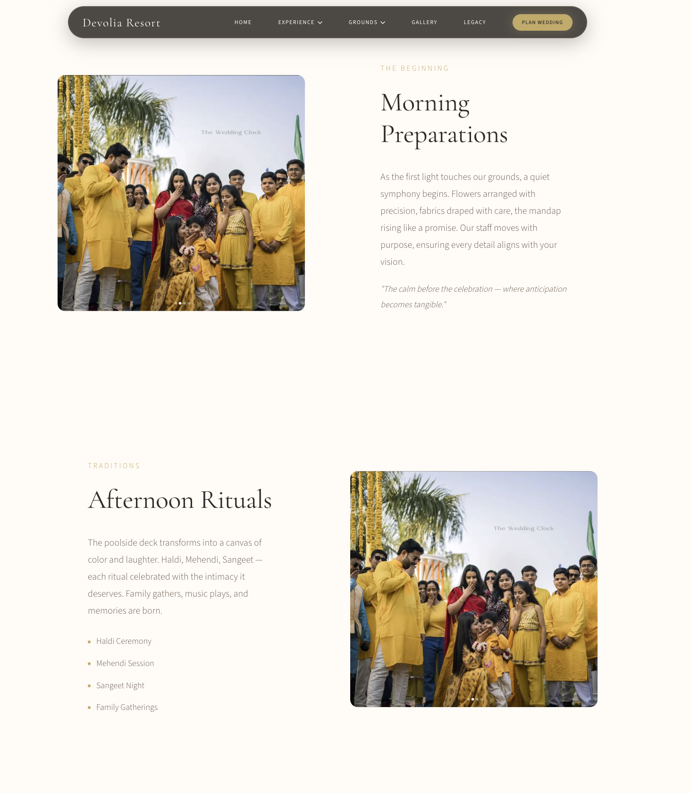
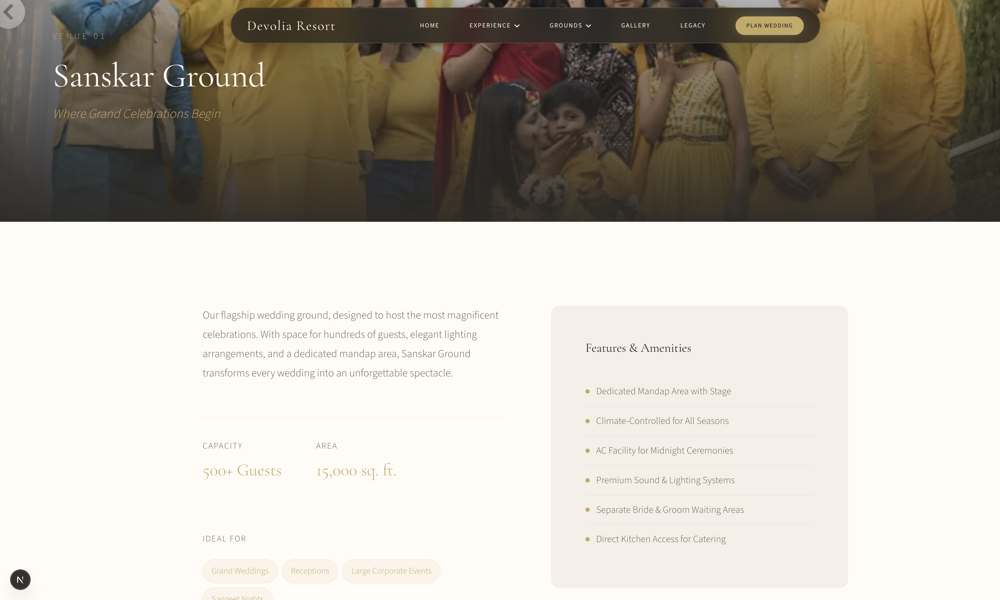
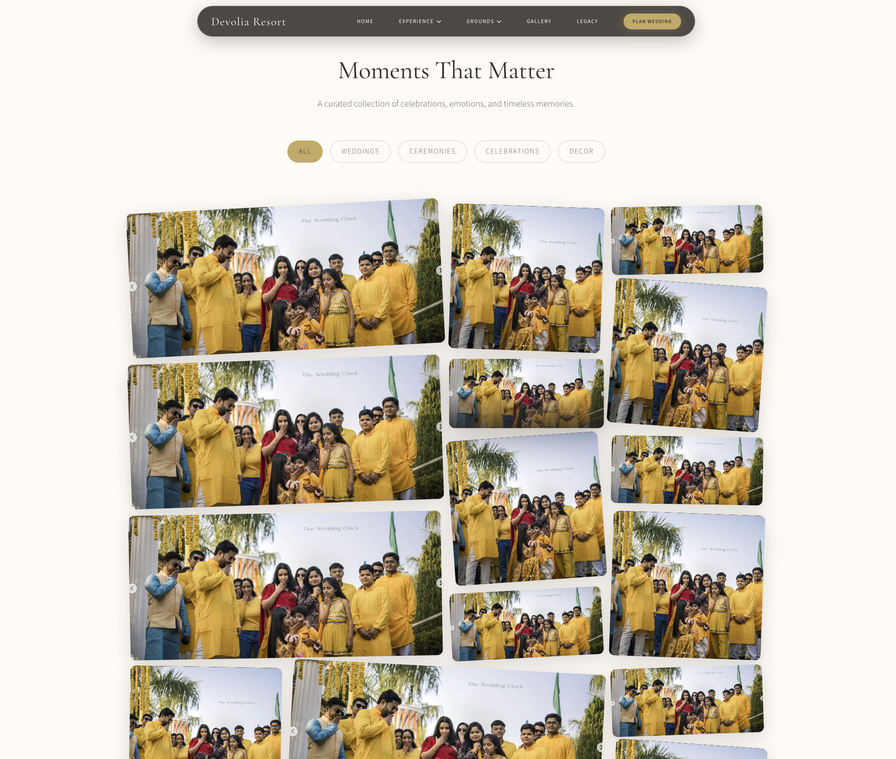
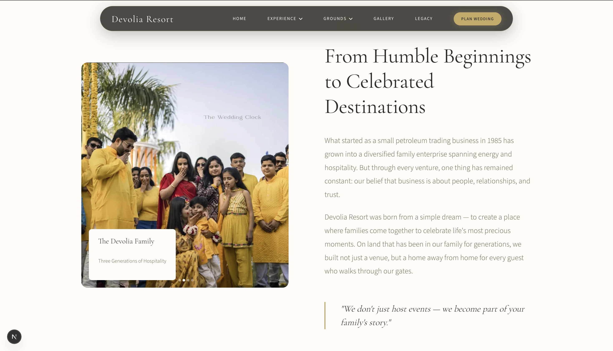
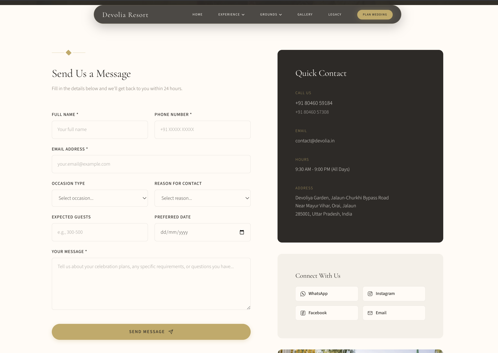

<p align="center">
  
</p>

<h1 align="center">Devolia Resort | Premium Wedding Destination</h1>

<p align="center">
  <b>A Luxury Experience for Timeless Celebrations in Orai, Uttar Pradesh</b>
</p>

<p align="center">
  
  
  
  
  
  
</p>

---

Devolia Resort is a luxury web application designed to showcase Orai's most prestigious wedding destination. Built with Next.js and TypeScript, this project features a premium, immersive user interface with smooth GSAP animations, glassmorphism aesthetics, and a responsive design tailored for mobile and desktop users.

> **✨ Live Demo:** [https://devolia-resort.vercel.app/](https://devolia-resort.vercel.app/)

## 🚀 Technology Stack

- **Framework:** [Next.js 16](https://nextjs.org/) (App Router)
- **Language:** TypeScript
- **Styling:** Custom CSS with CSS Variables, Tailwind CSS (configuration)
- **Animations:** [GSAP](https://greensock.com/) (ScrollTrigger)
- **Icons:** Custom Premium SVGs
- **Email:** Nodemailer (Contact Form)
- **Maps:** Google Maps Embed

## 📸 Visual Showcase

<table width="100%">
  <tr>
    <td width="50%">
      <p align="center"><b>Home Page</b></p>
      
    </td>
    <td width="50%">
      <p align="center"><b>Experience</b></p>
      
    </td>
  </tr>
  <tr>
    <td width="50%">
      <p align="center"><b>Grounds</b></p>
      
    </td>
    <td width="50%">
      <p align="center"><b>Gallery</b></p>
      
    </td>
  </tr>
  <tr>
    <td width="50%">
      <p align="center"><b>Legacy</b></p>
      
    </td>
    <td width="50%">
      <p align="center"><b>Contact</b></p>
      
    </td>
  </tr>
</table>

## 📂 Pages & Features

The application consists of several key sections, each designed to provide a rich user experience:

### 1. **Home (`/`)**
The landing page sets the tone with a cinematic hero section, introducing the resort's elegance.
- **Hero Section:** Full-screen video background with animated typography.
- **Introduction:** Brief overview of the resort.
- **Facilities:** Interactive grid showcasing amenities (Suites, Parking, Security, etc.) with premium SVG animations.
- **Testimonials:** Client reviews in a horizontal scroll layout.

### 2. **Experience (`/experience`)**
A detailed showcase of the types of events hosted at Devolia.
- **Weddings:** Grand celebrations with custom visual storytelling.
- **Birthdays & Parties:** Vibrant sections for intimate gatherings.
- **Corporate:** Professional event setups.
- **Auto-Scrolling Visuals:** Infinite scrolling image bands for each category.

### 3. **Grounds (`/grounds`)**
Explore the specific venues within the resort.
- **Sanskar Ground:** The main grand lawn for massive events.
- **Sagun Ground:** A dedicated space for pre-wedding rituals.
- **Poolside Deck:** Luxury area for cocktail parties and halftime events.
- **Features:** Capacity details, area specifications, and image galleries for each venue.

### 4. **Gallery (`/gallery`)**
A visual journey through the resort's best moments.
- **Masonry Grid:** Artistic layout of high-quality images with hover effects.
- **Reels Section:** Vertical video card layout inspired by social media reels.
- **Featured Stories:** Polaroid-style photo cards capturing special memories.

### 5. **Legacy (`/legacy`)**
The story behind the brand.
- **History:** Timeline of the Devolia Group's journey.
- **Values:** Core philosophy (Trust, Excellence, Legacy) illustrated with icons.
- **Ventures:** Overview of sister concerns (Petroleum, Upcoming Hotels).

### 6. **Contact (`/contact`)**
Get in touch with the resort team.
- **Contact Form:** a comprehensive form with "Occasion" and "Reason" selectors.
- **Real-time Validation:** Instant feedback on form interactions.
- **Google Maps:** Embedded location for easy navigation.
- **Social Links:** Direct access to WhatsApp, Instagram, and Facebook.
- **Backend Integration:** API route (`/api/contact`) sending real emails via Nodemailer.

## 🛠️ Getting Started

First, clone the repository:

```bash
git clone https://github.com/yourusername/devolia-resort.git
cd devolia-resort
```

Install the dependencies:

```bash
npm install
```

Run the development server:

```bash
npm run dev
```

Open [http://localhost:3000](http://localhost:3000) with your browser to see the result.

## ⚙️ Environment Variables

To make the contact form work, create a `.env` file in the root directory (refer to `env.example.txt`):

```bash
EMAIL_USER=your-email@gmail.com
EMAIL_PASS=your-app-specific-password
```

## 🎨 Design System

The project uses a custom design system defined in `app/globals.css`:
- **Colors:** Premium palette (Ivory, Charcoal, Gold options).
- **Typography:** *Cormorant Garamond* (Headings) and *Source Sans 3* (Body).
- **Components:** Reusable UI components like `.btn-primary` (Gold/Dark gradient) and `.btn-glass` (Frosted glass effect).

## 📂 Project Architecture

```text
devolia-resort/
├── app/                    # Next.js App Router (Routes & Core Logic)
│   ├── api/                # Backend API Routes (Email handling)
│   ├── contact/            # Contact & Inquiry Page
│   ├── experience/         # Events & Celebrations Showcase
│   ├── gallery/            # Visual Media & Reels Section
│   ├── grounds/            # Detailed Venue Specifications
│   ├── legacy/             # Brand History & Ventures
│   ├── globals.css         # Global Styles & CSS Design Tokens
│   ├── layout.tsx          # Root Layout & SEO Metadata
│   └── page.tsx            # Home / Landing Page
├── components/             # Component-Based Architecture
│   ├── animations/         # GSAP ScrollTrigger Configurations
│   ├── Hero.tsx            # High-Impact Entry Section
│   ├── Navbar.tsx          # Dynamic Premium Navigation
│   ├── PremiumSVGs.tsx     # Custom Hand-Crafted SVG Assets
│   ├── GalleryPreview.tsx  # Interactive Masonry Layout
│   ├── FacilitiesSection.tsx# Amenity Grid with Micro-animations
│   └── ...                 # Modular UI Elements
├── public/                 # Static Resources
│   ├── images/             # High-Resolution Backgrounds & Icons
│   └── screenshots/        # Project Documentation Captures
├── next.config.ts          # Project Configuration
├── package.json            # Scripts & Dependencies
├── tailwind.config.ts      # Design Token Integration
└── tsconfig.json           # Type Safety Configuration
```

## 📄 License

This project is proprietary software belonging to Devolia Resort.
